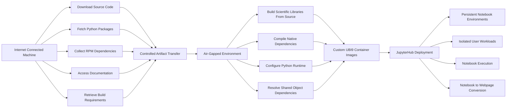
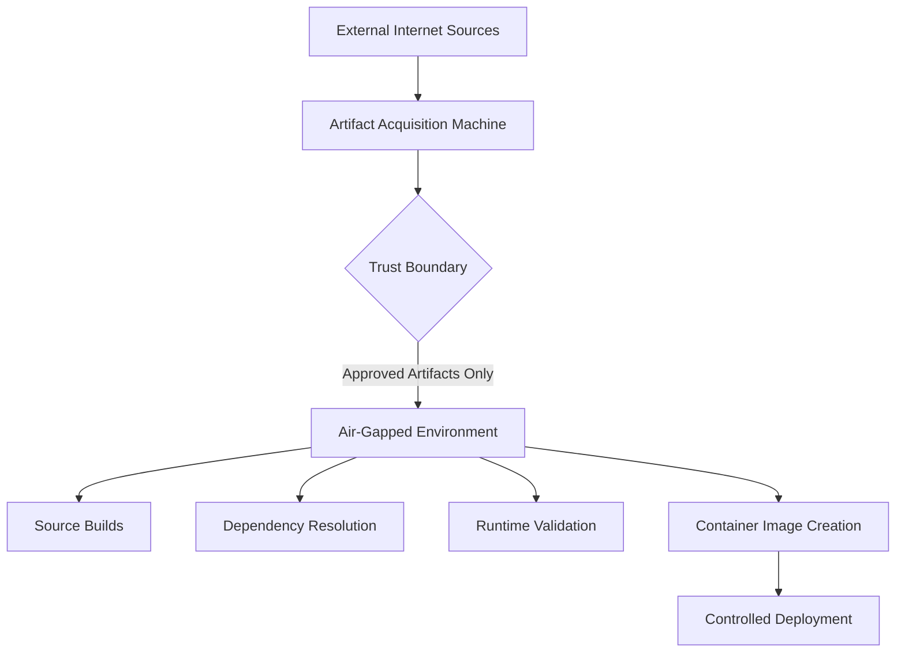
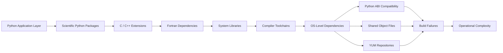
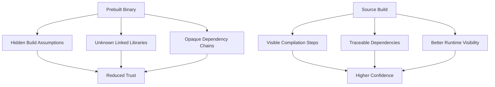
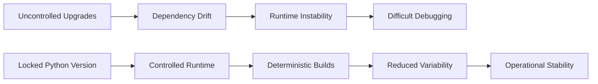
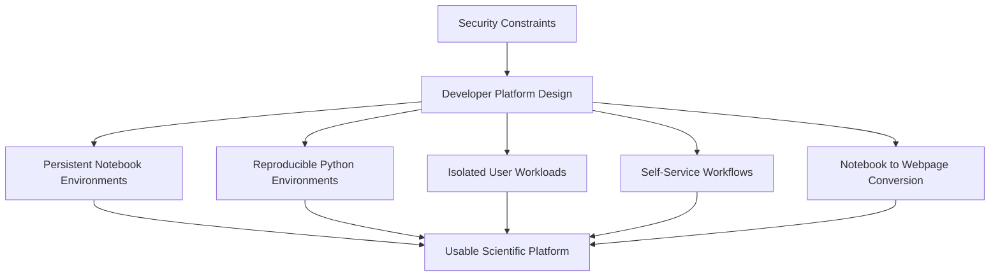

# What building in air-gapped environments taught me about supply-chain trust

## Introduction

A few days ago, I was reading [Chainguard’s article on preventing malware in Chainguard Libraries](https://www.chainguard.dev/unchained/how-does-chainguard-prevent-malware-in-chainguard-libraries). Their emphasis on building binaries directly from source rather than inheriting trust from opaque upstream artifacts felt strangely familiar.

It reminded me of some of the work we did while building secure JupyterHub environments for scientific workloads at SAC, ISRO.

At the time, I never thought about it in terms like “software supply-chain security” or “artifact provenance.” We were mostly trying to make scientific computing work reliably inside partially air-gapped environments. Looking back now, I realize many of the operational constraints we dealt with naturally pushed us toward questions the industry is now formalizing much more explicitly.

---

## Air-Gapped Workflow

The first thing air-gapped systems change is your relationship with the internet itself.

In most engineering environments today, the network quietly becomes part of the runtime. Dependencies are downloaded dynamically. Container images are pulled from registries without much thought. Package managers resolve transitive dependencies invisibly. Trust is inherited passively because the surrounding ecosystem is designed to feel frictionless.

Inside constrained systems, that abstraction disappears very quickly.

We primarily worked on isolated systems with a single internet-connected machine acting as the external acquisition point. Source code, Python packages, RPM dependencies, documentation, and build requirements were collected there first and then transferred internally into the air-gapped environment where the actual builds happened.

That workflow changes how you think about software almost immediately.

A simple `pip install` no longer feels lightweight. Every dependency introduces questions around compatibility, reproducibility, runtime behavior, and operational trust boundaries. The movement of artifacts itself becomes important because software no longer enters the environment invisibly.

---

## Trust Boundaries

Over time, source builds started feeling easier to trust than binaries we did not fully understand.

Not because source builds are automatically safer, but because they exposed more of the system. Compilation steps became visible. Linked libraries became visible. Runtime incompatibilities became visible. Hidden assumptions became visible.

---

## Scientific Python Dependencies

Scientific Python ecosystems amplified this in ways I did not fully appreciate initially.

A large part of the environment depended on libraries like Astropy, Skyfield, and SunPy, along with geospatial tooling around GDAL and several native dependencies sitting underneath the Python layer.

At first, the environment looked manageable. Most libraries installed normally until geospatial tooling entered the picture.

GDAL in particular became a recurring source of operational pain.

Sometimes a build would succeed on one system and fail silently inside another environment with an almost identical dependency graph. Other times the Python environment itself looked healthy while a missing `.so` dependency several layers below quietly broke runtime behavior. There were cases where the compiler version was technically compatible, but linked against libraries the isolated runtime environment could not properly resolve later.

A surprising amount of engineering time went into tracing dependency behavior rather than writing application code.

That experience changed how I thought about dependency trees entirely.

In normal internet-connected environments, package managers hide most dependency complexity behind a single command. Inside isolated systems, every dependency becomes visible at once. Native libraries, compiler toolchains, Python ABI compatibility, yum repositories, runtime linkages - everything surfaces eventually.

Dependency drift stopped feeling like maintenance overhead and started feeling more like operational uncertainty.

---

## Source Builds vs Prebuilt Binaries

One practical decision we made fairly early was locking Python versions and building the environment around a controlled runtime combination. Initially it felt like operational convenience. Over time it became clear it was actually a way of reducing uncertainty inside an already fragile ecosystem.

Scientific stacks are difficult enough without uncontrolled upgrades introducing additional instability.

Keeping runtimes predictable reduced rebuild complexity, minimized subtle incompatibilities, and made debugging far more survivable in constrained environments where iteration cycles were naturally slower.

---

## Locked Runtimes and Reproducibility

The container layer mattered for similar reasons.

We built our custom images on top of UBI9 largely because it provided a stable and enterprise-grade base to build on. In environments where scientific dependencies were already complicated enough, reducing variability at the operating system layer improved reproducibility and long-term maintainability significantly.

What I find interesting now is how many modern supply-chain-security conversations revolve around operational realities that constrained systems naturally expose.

At the time, we were not implementing SBOM pipelines, signed artifacts, provenance frameworks, or attestation systems explicitly. But many of the underlying concerns were already present. Questions around dependency trust, deterministic environments, artifact control, and reproducibility emerged naturally once internet access stopped being treated as invisible infrastructure.

---

## Platform Engineering Under Constraints

Even developer experience started looking different under those constraints.

The goal was not only to secure infrastructure. Researchers still needed environments that were usable. We spent considerable effort building persistent notebook environments, reproducible Python setups, isolated workloads, and workflows like one-click notebook-to-webpage conversion because security constraints alone are not enough to make a platform useful.

That experience changed how I think about platform engineering more broadly.

Infrastructure systems are also trust systems. And trust is often shaped less by explicit security policy and more by operational design decisions quietly accumulating underneath developer workflows.

Looking back, I do not think air-gapped systems necessarily made development harder.

They simply made inherited trust assumptions impossible to ignore.

---

## Further Context

I also had the opportunity to speak publicly about parts of this infrastructure work and the JupyterHub ecosystem we built around constrained scientific workloads. Looking back, many of the operational concerns discussed there now feel closely connected to broader conversations around software trust, reproducibility, and infrastructure design.

[Watch the talk on YouTube](https://www.youtube.com/live/NyQced4oJVM?t=9548s)
