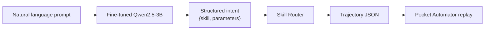

Built for the [Build Small Hackathon](https://huggingface.co/build-small-hackathon) Backyard AI track, sponsored by Modal. Also published on [Hugging Face](https://huggingface.co/blog/build-small-hackathon/android-skill-router).

## Introduction

How does a 3B-parameter model turn messy phone requests into replayable UI automation without shipping your life to a cloud API?

---

## The Problem with Phone Automation Today

You say: *"text mom on whatsapp i'm on my way."*

A voice assistant might reply with a web search, a generic "I can't do that," or a cloud API call that only works if WhatsApp cooperates. What you actually want is simpler and more direct: open WhatsApp, find Mom, type the message, send it.

That gap between **natural language** and **deterministic UI actions on a real device** is what **Android Skill Router** is built to close.

### Why cloud agents fall short for personal automation

Most phone automation today follows one of two paths:

| Approach | Strength | Weakness |
| --- | --- | --- |
| **Cloud voice assistants** | Understand broad language | Can't tap your apps; privacy concerns; needs network |
| **Macro/script tools** | Deterministic replay | Require exact trigger phrases; no natural language |
| **Vision-based agents** | Flexible | Slow, expensive, hallucinate UI coordinates |

Android Skill Router takes a third path: **a small local classifier that understands messy language, paired with pre-recorded UI trajectories that an accessibility runtime replays exactly.**

The core insight:

> You don't need a 70B frontier model to *do* the tapping. You need a 3B model to understand *what you mean*, then hand off to a fixed replay plan.

```
"play my workout playlist"
    → spotify_play_playlist
    → trajectories/spotify_play_playlist.json
    → Pocket Automator replays taps on device
```

This is the classifier layer of the **[Pocket Automator](https://github.com/kriyanshii/pocket-automator)** stack: record once on your phone, route forever with a tiny local model.

---

## The Architecture: Classify, Route, Replay

The system has three layers, each deliberately small and composable.

*Figure: Natural language prompts flow through a fine-tuned classifier into skill routing and trajectory replay.*



### Layer 1: Intent classifier

A fine-tuned **Qwen2.5-3B-Instruct** model receives a user prompt and returns structured JSON:

```json
{
  "skill": "whatsapp_send_message",
  "parameters": {
    "contact": "mom",
    "message": "i'm on my way"
  }
}
```

The model handles slang, typos, incomplete phrasing, and app disambiguation (WhatsApp vs Gmail vs Slack). It never invents UI steps. It only picks from 15 known skills and extracts parameter slots.

### Layer 2: Skill router

A deterministic lookup table maps skill names to trajectory files:

```python
SKILL_TO_TRAJECTORY = {
    "whatsapp_send_message": "trajectories/whatsapp_send_message.json",
    "spotify_play_playlist": "trajectories/spotify_play_playlist.json",
    # ... 15 skills total
}
```

If the model returns `whatsapp_send_message`, the router loads `trajectories/whatsapp_send_message.json`. No guessing, no hallucination. If the skill doesn't exist or the file is missing, the system fails loudly with a clear error.

The router also includes **defensive parsing**: skill aliases (`send_whatsapp` → `whatsapp_send_message`), JSON extraction from noisy model output, and keyword fallbacks when the model returns an unknown label.

### Layer 3: Trajectory replay

Each trajectory is a JSON file exported from **[Pocket Automator](https://github.com/kriyanshii/pocket-automator)**, an Android accessibility recorder. It contains:

- A **task description** (the original human intent)
- The **target app package** (`com.whatsapp`, `com.spotify.music`, etc.)
- A sequence of **steps**, each with a full UI tree snapshot and an action

Example step from a WhatsApp trajectory:

```json
{
  "timestamp": 4024,
  "screen": { /* full accessibility tree */ },
  "action": {
    "type": "click",
    "resourceId": "com.motorola.launcher3:id/icon",
    "contentDescription": "WhatsApp",
    "path": [0, 0, 0, 0, 2, 0, 0]
  },
  "packageName": "com.motorola.launcher3"
}
```

Action types include `click`, `set_text`, and scroll gestures. Pocket Automator resolves nodes at replay time using resource IDs, content descriptions, and tree paths, so minor UI changes don't break the flow.

### The separation of concerns

| Component | Responsibility | Can fail? |
| --- | --- | --- |
| Language model | Understand intent | Gracefully; fallbacks exist |
| Skill router | Map intent → file | Never; deterministic lookup |
| Trajectory | Store ground-truth UI steps | Never; fixed recording |
| Pocket Automator | Execute on device | Only if UI changed drastically |

This is the design bet: **language understanding is fuzzy; automation must be exact.**

---

## Recording UI Flows on Android

Every skill starts on hardware you own. No synthetic UI trees, no emulated taps, real recordings from a real Motorola device.

### Pocket Automator: the Android recorder

**[Pocket Automator](https://github.com/kriyanshii/pocket-automator)** is an Android accessibility app that:

1. **Records** taps, text input, and scrolls while you use any app
2. **Captures** the full accessibility tree at each step (node IDs, bounds, class names, text)
3. **Exports** recordings as JSON for training pipelines
4. **Replays** saved recordings with smart node resolution

Requirements: Android 10+ (API 29), accessibility service enabled, overlay permission.

### The recording workflow

1. Open Pocket Automator and tap **Record**
2. Name your task (e.g., "message hi to biraj on WhatsApp")
3. Perform the task naturally on your phone
4. Stop recording from the floating overlay
5. Export the JSON to your development machine
6. Place it in `trajectories/` and run `scripts/generate_skill_dataset.py`

The script reads each trajectory's `task` and `app` fields, derives a snake_case skill name, and writes `data/skills.jsonl`:

```json
{"skill": "whatsapp_send_message", "task": "message hi to biraj on WhatsApp"}
{"skill": "spotify_play_playlist", "task": "play liked songs playlist from Spotify"}
{"skill": "create_alarm", "task": "create alarm for 7 am tomorrow"}
```

Skill name derivation uses app package and task keywords, WhatsApp tasks become `whatsapp_send_message`, Spotify pause tasks become `spotify_pause`, and so on.

### The 15 skills

| Skill | App | Example task |
| --- | --- | --- |
| `create_alarm` | Clock | Set alarm for 7 am tomorrow |
| `calendar_create_event` | Calendar | Create event tomorrow 4 pm |
| `wifi_enable` | Settings | Enable Wi-Fi |
| `bluetooth_enable` | Settings | Turn on Bluetooth |
| `whatsapp_send_message` | WhatsApp | Message a contact |
| `gmail_send_email` | Gmail | Send email to recipient |
| `slack_open_channel` | Slack | Open a channel |
| `spotify_play_playlist` | Spotify | Play a playlist |
| `spotify_search_play` | Spotify | Search and play music |
| `spotify_pause` | Spotify | Pause playback |
| `uber_request_ride` | Uber | Request ride to destination |
| `youtube_search` | YouTube | Search for videos |
| `linkedin_search_person` | LinkedIn | Search for a person |
| `contacts_search` | Contacts | Find a contact |
| `camera_take_photo` | Camera | Take a picture |

Each trajectory file is large (often 5,000+ lines) because it includes the full accessibility tree at every step. That's intentional, replay engines need rich node metadata to resolve targets reliably.

### Why real recordings matter

Synthetic UI automation data is brittle. Real recordings capture:

- **Launcher states**: how your home screen looks with your app icons
- **Keyboard transitions**: when the soft keyboard appears during text input
- **Scroll positions**: where list items sit after scrolling
- **Timing**: natural pauses between actions

These details can't be generated. They're the ground truth that makes replay work on your specific device.

---

## Training a Tiny Classifier

The model is **[Qwen2.5-3B-Instruct](https://huggingface.co/Qwen/Qwen2.5-3B-Instruct)**: deliberately under 4B parameters for the Build Small Hackathon's *Tiny Titan* achievement.

### Why 3B is enough

The classification task is narrow:

- **15 skill labels** (not open-ended tool use)
- **Structured JSON output** (not free-form text)
- **Parameter slot-filling** (contact, message, time, not reasoning chains)

A 3B instruct model already understands apps, contacts, times, and natural language phrasing. Fine-tuning teaches it *your* skill taxonomy and output format, not general Android knowledge.

### Training configuration

Training runs on **Modal** GPUs via `modal_apps/train_modal.py`:

| Hyperparameter | Value |
| --- | --- |
| Base model | Qwen2.5-3B-Instruct |
| Method | 4-bit QLoRA + SFT (Unsloth) |
| LoRA rank | 32 |
| LoRA alpha | 32 |
| Target modules | q/k/v/o_proj, gate/up/down_proj |
| Epochs | 5 |
| Batch size | 8 |
| Learning rate | 2e-4 |
| Optimizer | AdamW 8-bit |
| Max sequence length | 2048 |
| GPU | Modal A10G |

The training pipeline:

1. Upload `data/train_intent.jsonl` to a Modal Volume
2. Load base model in 4-bit quantization
3. Apply QLoRA adapters to attention and MLP layers
4. Format examples with Qwen 2.5 chat template
5. Train with TRL's `SFTTrainer`
6. Save LoRA adapter to `/model/adapter`
7. Save merged 16-bit model to `/model/merged`

```bash
python scripts/generate_intent_dataset.py
modal run modal_apps/train_modal.py --dataset train_intent.jsonl
modal volume get android-dataset-model adapter ./trained_model/adapter
```

### V1 → V2: from labels to intents

**V1 (skill classification only)** mapped prompts to a skill name:

```
"play my workout playlist" → {"skill": "spotify_play_playlist"}
```

Training data: ~510 examples in `data/train.jsonl` (~30 variations per skill).

**V2 (structured intent extraction)** adds parameter slot-filling:

```
"text mom on whatsapp i'm on my way"
→ {"skill": "whatsapp_send_message", "parameters": {"contact": "mom", "message": "i'm on my way"}}
```

Training data: ~15,000 examples in `data/train_intent.jsonl` (~1,000 per skill).

### Parameter schemas

Each skill declares its parameters in `data/skill_schemas.json`:

```json
{
  "whatsapp_send_message": {
    "description": "Send a WhatsApp message to a contact",
    "parameters": {
      "contact": {"type": "string", "required": true},
      "message": {"type": "string", "required": true}
    }
  },
  "create_alarm": {
    "description": "Set an alarm at a specific time",
    "parameters": {
      "time": {"type": "string", "required": true},
      "day": {"type": "string", "required": false}
    }
  },
  "wifi_enable": {
    "description": "Enable Wi-Fi on the device",
    "parameters": {}
  }
}
```

Skills with no variable inputs (`wifi_enable`, `bluetooth_enable`, `spotify_pause`, `camera_take_photo`) return empty parameter objects.

### The system prompt

The model receives a tight, deterministic instruction:

```
You extract structured Android automation intents from natural language.
Reply with JSON only: {"skill": "<skill_name>", "parameters": {<extracted_fields>}}.
Pick exactly one skill. Extract all relevant parameters mentioned in the request
(contact names, messages, times, destinations, channel names, search queries, etc.).
Use an empty object for parameters when the skill needs none.
Use the app or action named in the request (contacts, Gmail, Slack, YouTube, etc.)
to pick the correct skill.
```

No chain-of-thought. No tool descriptions. No examples in the prompt. Just JSON.

### Training example format

Each row in `train_intent.jsonl` is a three-turn chat:

```json
{
  "messages": [
    {"role": "system", "content": "You extract structured Android automation intents..."},
    {"role": "user", "content": "whatsapp message Vikram see you tonight"},
    {"role": "assistant", "content": "{\"skill\":\"whatsapp_send_message\",\"parameters\":{\"contact\":\"Vikram\",\"message\":\"see you tonight\"}}"}
  ]
}
```

The assistant always responds with compact JSON, no markdown fences, no explanation.

---

## Synthetic Data at Scale

Fifteen real trajectories can't train a robust classifier alone. The project generates **~15,000 synthetic SFT examples** locally via `scripts/generate_intent_dataset.py`.

### How data generation works

The generator follows a four-step pipeline:

```
skill_schemas.json + skills.jsonl
        ↓
   Entity pools (contacts, messages, times, destinations...)
        ↓
   Template variations (24+ templates per skill)
        ↓
   train_intent.jsonl (~1000 examples/skill)
   eval_intent_prompts.json (~6 held-out prompts/skill)
```

### Entity pools

Realistic but synthetic entities ensure diversity without privacy concerns:

| Pool | Examples |
| --- | --- |
| **Contacts** | Ri, Biraj, Mom, Parag Shah, grandma, my roommate |
| **Messages** | "see you soon", "running late", "project update attached" |
| **Alarm times** | 5 am, 6:30 am, 7 am, noon, 10 pm |
| **Alarm days** | today, tomorrow, monday, next friday |
| **Destinations** | airport, train station, home, office |
| **Playlists** | workout, liked songs, chill vibes, focus |
| **Channels** | engineering, general, data contributors |
| **Search queries** | pasta recipes, jazz music, ghibli food |

### Template variations

Each skill has 15–30 prompt templates with placeholder slots:

**WhatsApp templates:**
```
"message {message} to {contact} on whatsapp"
"text {contact} {message} on whatsapp"
"whatsapp {contact} saying {message}"
"ping {contact} on whatsapp with {message}"
```

**Alarm templates:**
```
"create alarm for {time} {day}"
"wake me up at {time} {day}"
"set a {time} alarm for {day}"
"{time} alarm {day} please"
```

**Uber templates:**
```
"get an uber to {destination}"
"uber me to {destination}"
"book a cab to {destination} via uber"
```

Templates are crossed with random entity samples to produce unique training pairs. The same intent can appear as:

- "set an alarm for 7 am tomorrow"
- "wake me up at seven tomorrow morning"
- "7am alarm pls"
- "please alarm 7 am tomorrow thanks"

### V1 training data (skill-only)

The earlier `scripts/generate_training_data.py` produces ~510 examples for V1 classification:

- 30 variations per skill from `skills.jsonl` task descriptions
- Guaranteed inclusion of Gradio demo prompts
- Regex-based parsing of task strings to derive alarm times, contacts, etc.

### Held-out evaluation sets

Two evaluation sets prevent overfitting to templates:

| File | Size | Purpose |
| --- | --- | --- |
| `data/eval_intent_prompts.json` | ~90 prompts | Structured eval during training |
| `data/pocket_benchmark_prompts.json` | 200 prompts | Real-world messy language benchmark |

The Pocket Automator benchmark is intentionally unlike training data, slang, typos, incomplete phrasing, conversational filler:

```
"yo set an alrm for like 5:45 tmrw morning pls"
"need to b up at 6ish on monday ngl"
"hit up zoe on whatsapp say im omw"
"wa msg marcus 'running 20 min late'"
"lowkey need 11:11 pm alarm tonight"
"deadass need alarm sunday noon"
```

Each benchmark case is tagged with `domain` (alarms, whatsapp, spotify...) and `styles` (slang, typo, incomplete, conversational). Prompts are filtered against training data to ensure zero overlap.

---

## Deployment and Demo

### Modal inference API

Training and inference both run on **Modal**: serverless GPU infrastructure with persistent volumes.

`modal_apps/predict_api.py` deploys a FastAPI endpoint:

```bash
modal deploy modal_apps/predict_api.py
# → https://<workspace>--android-skill-predict-api-skillpredictor-web.modal.run
```

Architecture:

- **Container class** `SkillPredictor` loads the QLoRA model once via `@modal.enter()`
- **4-bit quantized** base model + LoRA adapter from Modal Volume
- **Greedy decoding** (`do_sample=False`) for deterministic JSON output
- **128 max new tokens**: enough for any intent JSON
- **5-minute scale-down window**: containers stay warm between requests

Request/response:

```bash
curl -X POST https://.../predict \
  -H "Content-Type: application/json" \
  -d '{"prompt": "text mom on whatsapp i am on my way"}'
```

```json
{
  "skill": "whatsapp_send_message",
  "parameters": {
    "contact": "mom",
    "message": "i am on my way"
  }
}
```

The API applies the same post-processing as local evaluation: JSON extraction, skill normalization, alias resolution, and keyword fallbacks.

### Gradio demo

The **Gradio demo** (`app.py`) is the hackathon submission UI, hosted on Hugging Face Spaces.

Flow:

1. User types a natural language prompt (or picks an example)
2. App POSTs to Modal `/predict` endpoint
3. Response is parsed: skill label, parameter tiles, confidence display
4. Skill router loads the matching trajectory from `trajectories/`
5. UI shows task description, app package, step count, and trajectory preview

Example prompts built into the demo:

- "play my workout playlist"
- "turn bluetooth on"
- "wake me up tomorrow morning"
- "send ri a message on whatsapp"
- "book an uber to the airport"

The Space doesn't ship model weights, inference stays on Modal. Only a `MODAL_PREDICT_URL` secret is needed.

### Local development

Three commands to run everything locally:

```bash
# 1. Generate training data
python scripts/generate_intent_dataset.py

# 2. Train on Modal GPU
modal run modal_apps/train_modal.py --dataset train_intent.jsonl

# 3. Deploy inference + run demo
modal deploy modal_apps/predict_api.py
export MODAL_PREDICT_URL="https://..."
python app.py
```

Evaluation can run locally on CPU/MPS if you download the adapter:

```bash
modal volume get android-dataset-model adapter ./trained_model/adapter
python -m src.evaluate_intent
```

---

## Evaluation

### Metrics

Three metrics capture different levels of correctness:

| Metric | Definition | What it measures |
| --- | --- | --- |
| **Skill accuracy** | Predicted skill matches expected | App/action disambiguation |
| **Parameter accuracy** | All expected parameters match (normalized) | Slot-filling quality |
| **Exact JSON match** | Skill + all parameters match exactly | End-to-end correctness |

Parameter matching uses normalized lowercase comparison, `"Mom"` matches `"mom"`, extra whitespace is stripped.

### Pocket Automator benchmark results

Evaluation on **200 held-out prompts** with slang, typos, and conversational phrasing:

| Metric | Score |
| --- | --- |
| **Skill accuracy** | 99.0% |
| **Parameter accuracy** | 86.0% |
| **Exact JSON match** | 85.5% |

The model almost never picks the wrong app or action. Parameter extraction is harder, preserving informal time expressions like `"6ish"` vs normalizing to `"6 am"`, but 86% is strong for a 3B model with no cloud fallback.

### Where errors happen

Parameter failures tend to cluster around:

- **Informal time expressions**: "6ish on monday" vs `"time": "6 am", "day": "monday"`
- **Abbreviated days**: "tmrw" vs "tomorrow morning"
- **Message truncation**: model drops filler words the benchmark expects verbatim
- **Contact nicknames**: "roomie" vs a full name

Skill errors (1%) mostly involve near-miss disambiguation, Spotify search-and-play vs play-playlist when the prompt is ambiguous.

### Evaluation commands

```bash
# On Modal GPU
modal run modal_apps/evaluate_intent_modal.py
modal run modal_apps/evaluate_pocket_benchmark_modal.py

# Locally
python -m src.evaluate_intent
python -m src.evaluate_pocket_benchmark
```

The pocket benchmark runner produces a confusion matrix, per-domain breakdown, and a failure report saved to `data/pocket_benchmark_report.txt`.

---

## Why This Approach Works

### 1. Local-first, privacy-preserving

A 3B model can run on-device (via llama.cpp, MLC, or similar) or on a small GPU. Your "text mom I'm running late" never needs to hit a frontier API. The entire inference stack fits in ~2GB of VRAM with 4-bit quantization.

### 2. Deterministic replay, not hallucinated taps

The model outputs a skill label and parameters. The trajectory is a fixed file recorded on a real device. No invented button coordinates, no drift between runs. If the model says `whatsapp_send_message`, you get the exact same tap sequence every time.

This is fundamentally different from vision-based agents that re-locate UI elements on every run and can click the wrong thing.

### 3. Cheap to extend

Adding a new skill is a repeatable pipeline:

1. Record one trajectory with Pocket Automator
2. Add parameter schema to `data/skill_schemas.json`
3. Add skill mapping to `src/skill_router.py`
4. Regenerate training data: `python scripts/generate_intent_dataset.py`
5. Fine-tune: `modal run modal_apps/train_modal.py --dataset train_intent.jsonl`

No prompt engineering session. No re-architecting the model. Just more data and another training run.

### 4. Separation of concerns

| Component | Responsibility | Swappable? |
| --- | --- | --- |
| Language model | Understand intent | Yes; any 3B instruct model |
| Skill router | Map intent → file | Yes; add skills without retraining |
| Pocket Automator | Execute UI steps | Yes; any accessibility replay engine |
| Trajectory JSON | Store ground truth | Yes; re-record when UI changes |

Each piece can be improved independently. Better model? Swap the adapter. UI changed? Re-record one trajectory. New app? Add a skill.

### 5. Designed for the "backyard"

This project targets **personal automation on hardware you own**: the Backyard AI track. It's not trying to automate every Android app in existence. It's trying to automate *your* apps, *your* flows, *your* phrasing, with a model small enough to run locally.

---

## What's Next

### The current gap

V2 extracts parameters at inference time:

```
"text mom on whatsapp i'm on my way"
→ {"contact": "mom", "message": "i'm on my way"}
```

But trajectories are still recorded with **fixed entities**: the WhatsApp trajectory says "message hi to biraj" and the `set_text` actions contain `"hi"` and `"biraj"`. Replay uses those literal values, not the extracted parameters.

### The planned solution

**Slot-filling at replay time**: when the model returns `{"contact": "mom", "message": "i'm on my way"}`, the replay engine:

1. Identifies parameterizable steps in the trajectory (text input actions)
2. Substitutes extracted values into `set_text` actions
3. Uses smart node resolution to find the contact field, search box, etc.

This closes the loop:

```
Natural language → structured intent → parameterized replay on any device
```

The trajectory becomes a **template** rather than a fixed recording. Record once with placeholder entities, replay with any contact, message, time, or destination.

### Other future work

- **On-device inference**: run the 3B model locally without Modal
- **More skills**: maps, photos, settings toggles, banking apps
- **Multi-step intents**: "set alarm and text mom I'll be late"
- **Confidence calibration**: know when to ask the user for clarification
- **UI change detection**: alert when a trajectory needs re-recording

---

## Links

### Links

| Resource | URL |
| --- | --- |
| **Blog post** | [Hugging Face Blog; Android Skill Router](https://huggingface.co/blog/build-small-hackathon/android-skill-router) |
| **Live demo** | [android-skill-router on Hugging Face Spaces](https://huggingface.co/spaces/build-small-hackathon/android-skill-router) |
| **Demo video** | [YouTube Short](https://youtube.com/shorts/IQRHf7HfTDA) |
| **Pocket Automator** | [GitHub: Android recorder and replay](https://github.com/kriyanshii/pocket-automator) |
| **Social post** | [Twitter/X](https://x.com/kriyanshii/status/2066587828839141634) |

### Quick start

```bash
git clone https://github.com/kriyanshii/android-dataset.git
cd android-dataset

# Generate intent training data
python scripts/generate_intent_dataset.py

# Train on Modal (requires modal setup)
pip install modal && modal setup
modal run modal_apps/train_modal.py --dataset train_intent.jsonl

# Deploy inference API
modal deploy modal_apps/predict_api.py

# Run Gradio demo
pip install -r requirements.txt
export MODAL_PREDICT_URL="https://<your-modal-url>/predict"
python app.py
```

### Project layout

```
app.py                      # Gradio demo (hackathon submission UI)
data/
  skill_schemas.json        # Parameter definitions per skill
  skills.jsonl              # Canonical skill ↔ task mapping
  train_intent.jsonl        # ~15k SFT examples (generated locally)
  eval_intent_prompts.json  # Held-out intent eval set
  pocket_benchmark_prompts.json  # 200 real-world messy prompts
src/
  skill_router.py           # Skill name → trajectory JSON
  skill_utils.py              # JSON parsing, aliases, fallbacks
  classifier_prompt.py        # System prompts for V1 and V2
  evaluate_intent.py          # Local evaluation
  pocket_benchmark.py         # Benchmark metrics and reports
modal_apps/
  train_modal.py              # QLoRA fine-tuning on Modal GPU
  predict_api.py              # FastAPI inference endpoint
  evaluate_intent_modal.py    # GPU evaluation
  evaluate_pocket_benchmark_modal.py
scripts/
  generate_skill_dataset.py   # trajectories → skills.jsonl
  generate_intent_dataset.py  # schemas → train_intent.jsonl
  generate_pocket_benchmark.py
trajectories/                 # Pocket Automator exports (15 skills)
```

---

## Summary

**Android Skill Router** shows that personal phone automation doesn't require a 70B agent in the cloud.

1. **Record** UI flows once on your Android device with Pocket Automator
2. **Fine-tune** a 3B model to understand how you actually talk (slang, typos, and all)
3. **Route** to deterministic trajectories, no hallucinated taps
4. **Replay** through accessibility APIs on real hardware

Classify → route → replay. Small model, real hardware, backyard-scale AI that actually does something useful.

---

*Apache 2.0. Base model weights subject to [Qwen license](https://huggingface.co/Qwen/Qwen2.5-3B-Instruct).*
