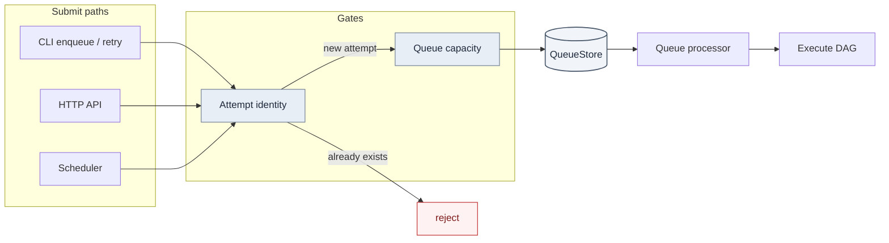
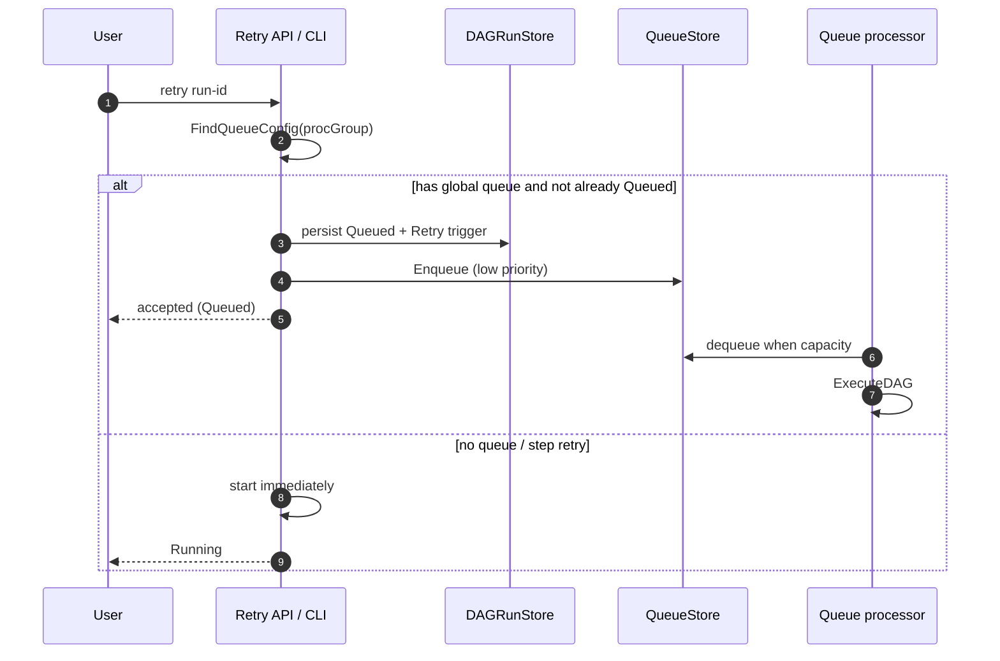

# How we built enqueue, retry, and dedup in a Go DAG scheduler

**Dagu** is an open-source, local-first workflow orchestrator (YAML DAGs, scheduler, queues, UI). I contribute Go backend + UI to [dagucloud/dagu](https://github.com/dagucloud/dagu) (formerly `dagu-org` / `yohamta`). This post covers three problems that show up once "run a DAG" becomes a **durable work queue**: enqueue routing, capacity-aware retries, and keeping runs reproducible / non-duplicated.

The design didn't start as an open-source feature request. It started as a production pain: turning satellite raw data into images in realtime, and occasionally reprocessing huge backfills of the same raw data. I'm a contributor, not the sole author. The queue story starts with that in-org implementation — stress-tested in production, then pitched to maintainer [Yota Hamada](https://github.com/yota-hamada) — which became [#690](https://github.com/dagucloud/dagu/pull/690) (closed unmerged as too large) and later the design basis for [#938](https://github.com/dagucloud/dagu/issues/938). Links below are to **my** follow-on merged PRs that shaped enqueue routing, capacity-aware retry, and reproducibility. Adjacent platform features (singleton enqueue, cursor pagination, SSE) landed via maintainer work and are noted as such.

---

## The shape of the problem

A DAG scheduler has to answer:

1. **Where does this run go?** (which queue / priority — realtime ingest vs backfill)
2. **What happens when it fails?** (retry now vs later, under what policy)
3. **How do we avoid duplicate or drifted runs?** (same identity, locked params, capacity honesty)

Naive answers ("just start the process") break under load: retries bypass capacity, queue config stuck in YAML can't handle "replay on the low-priority queue," and any nonzero exit gets treated the same.



---


## Origin: queues from production, not theory

We used Dagu to process satellite raw data into image products. Two workloads shared the same machines:

- **Realtime** — new raw data arrives, DAGs must start soon, capacity is scarce
- **Reprocessing** — occasionally we had to re-run a huge chunk of historical raw data through the same pipelines

At first we bolted on a sidecar microservice: poll how many DAGs were running, then decide whether to ingest the next batch. That worked until it didn't. Running count alone couldn't tell you what was waiting, what was stuck, or how a reprocessing flood would collide with realtime ingest. Operators couldn't see queued vs running work in one place, and admission logic lived outside the scheduler — so capacity honesty was always one API call behind reality.

So we implemented the queue **inside** our org's Dagu deployment: admit work into a durable queue, bound concurrency in the scheduler itself, and make running vs queued visible. We stress-tested it in production under realtime ingest and large reprocessing bursts, then pitched the design and implementation to maintainer [Yota Hamada](https://github.com/yota-hamada).

That became [#690](https://github.com/dagucloud/dagu/pull/690): file-backed queue + running-count stats, a flag so dequeued work went straight to running, and `DAGQueueLength`. It ran in production (multiple concurrent DAGs) but was closed as too large to review.

The work didn't disappear. Issue [#938](https://github.com/dagucloud/dagu/issues/938) explicitly cites `#690` as the initial implementation. Design notes there also absorb ideas I pushed in-thread: **config toggle to enable/disable queuing**, and **dequeue** so users can cancel work still waiting. When queues shipped in v1.17, the maintainer called out that original implementation by name.

The rest of this post is what I built on top of that foundation once queues existed in main: routing overrides (realtime vs backfill without editing YAML), retries that honor capacity, and locks so science / reprocessing runs stay reproducible.

## 1. Enqueue is a first-class path (not a side door)

**Queue override.** DAG YAML can declare a default queue, but operators often need this run on a different queue (backfill vs realtime) without editing the file.

Design:

- Persist an optional `Queue` on run status at enqueue time
- Resolution order: **stored override → DAG YAML `queue` → DAG name**

```bash
dagu enqueue --queue="realtime" data_processor.yaml
```

PR: [#1240 Add Queue Override Support for DAG Enqueue Operations](https://github.com/dagucloud/dagu/pull/1240)

**Enqueue from a spec.** API to enqueue a DAG-run from inline YAML (not only a file on disk) — useful for automation that composes runs dynamically.

PR: [#1375 New API endpoint for enqueuing a DAGRun from a spec](https://github.com/dagucloud/dagu/pull/1375)

**Operator hygiene.** Clear a queue; dequeue must pass the queue name (`ProcGroup`) or items get lost.

PRs: [#1299 clear queue](https://github.com/dagucloud/dagu/pull/1299), [#1481 include queue name in dequeue](https://github.com/dagucloud/dagu/pull/1481)

---

## 2. Retry must respect the same capacity as enqueue

The bug class: **retry ran immediately and skipped global queue capacity.**

Symptom: capacity = 3, but after retries you'd see 4 running. UI and scheduler disagreed. "Retry = start again" was wrong once queues existed.

Fix for DAGs on a global queue:

- Mark attempt **Queued**, stamp queue metadata, trigger type = Retry
- Enqueue at **low priority**
- Let the queue processor start it when capacity exists
- Step-level retry still runs immediately (processor doesn't carry step context)



PR: [#1676 scheduler: respect global queue capacity on retry](https://github.com/dagucloud/dagu/pull/1676)

**Exit-code-aware step retry.** Retries shouldn't fire on every failure. Step `retry_policy` can allowlist exit codes — retry on 429/503, fail fast otherwise.

```yaml
steps:
  - run: curl https://api.example.com/data
    retry_policy:
      limit: 6
      interval_sec: 1
      exit_code: [429, 503]
```

PR: [#902 custom exit codes on retry](https://github.com/dagucloud/dagu/pull/902)

Also: disable step-retry controls while the parent DAG is still running ([#1447](https://github.com/dagucloud/dagu/pull/1447)).

---

## 3. Dedup and reproducibility

**Parameter / run-ID locking.** For backfills, science pipelines, and audits, params and run identity shouldn't drift in the UI mid-flight:

```yaml
run_config:
  disable_param_edit: true
  disable_run_id_edit: true
```

PR: [#1176 Add DAG configuration to lock parameters and run ID](https://github.com/dagucloud/dagu/pull/1176)

**Attempt identity on enqueue.** Enqueue checks for an existing attempt before creating one — same DAG + run ID already exists ⇒ refuse. That store-backed identity is the foundation; opt-in **singleton** (409 if already running/queued) later landed as maintainer work ([#1483](https://github.com/dagucloud/dagu/pull/1483)) on top of the same problem space. Lesson: check-then-act alone is TOCTOU; real uniqueness needs store semantics.

---

## Status UX (supporting cast)

- Configurable "latest status" window ([#558](https://github.com/dagucloud/dagu/pull/558))
- Fix DAG list truncation from a hardcoded paginator cap ([#1126](https://github.com/dagucloud/dagu/pull/1126))
- Running/failed step names on run summaries for faster triage ([#1420](https://github.com/dagucloud/dagu/pull/1420))

Cursor pagination and SSE live updates were maintainer follow-ons — they scale the UI without changing the queue/retry core.

---

## Tradeoffs I'd make again

| Choice | Why | Cost |
|---|---|---|
| Retries go through the queue | Capacity stays honest; UI matches reality | Slightly higher latency to restart |
| Persist queue override on status | Routing survives restarts / processor hops | Extra field + resolution rules |
| Lock params / run ID | Reproducibility for batch & science | Less "edit and hot-retry" flexibility |
| Exit-code allowlist on retry | Fewer useless retries | Authors must document exit contracts |
| File-backed queues | Simple local-first ops | Harder atomic singleton than Redis |

---

## Why this matters for platform / workflow hiring

Same problem space as Temporal task queues, K8s job controllers, and CI runners — and the same shape as our satellite pipeline: **admit work, bound concurrency, retries that don't stampede, reproducible dispatch**, whether the next item is a realtime frame or a multi-day reprocessing chunk.

- GitHub: [github.com/kriyanshii](https://github.com/kriyanshii)
- Portfolio: [kriyanshii.github.io](https://kriyanshii.github.io/)
- Dagu: [github.com/dagucloud/dagu](https://github.com/dagucloud/dagu)
- Related: [Partial Success in DAG Systems (Medium)](https://medium.com/@kriyanshii/understanding-partial-success-in-dag-systems-building-resilient-workflows-977de786100f)

### My PRs referenced
- [#690](https://github.com/dagucloud/dagu/pull/690) original queue implementation (closed; design basis)
- [#938](https://github.com/dagucloud/dagu/issues/938) queue feature issue citing #690
- [#902](https://github.com/dagucloud/dagu/pull/902) exit-code retry  
- [#1176](https://github.com/dagucloud/dagu/pull/1176) lock parameters + run ID  
- [#1240](https://github.com/dagucloud/dagu/pull/1240) queue override on enqueue  
- [#1375](https://github.com/dagucloud/dagu/pull/1375) enqueue from spec API  
- [#1676](https://github.com/dagucloud/dagu/pull/1676) capacity-aware retry  
- [#1299](https://github.com/dagucloud/dagu/pull/1299) / [#1481](https://github.com/dagucloud/dagu/pull/1481) queue ops  
- [#1420](https://github.com/dagucloud/dagu/pull/1420) / [#1447](https://github.com/dagucloud/dagu/pull/1447) status UX  
- [#1613](https://github.com/dagucloud/dagu/pull/1613) production Helm chart (K8s signal)
