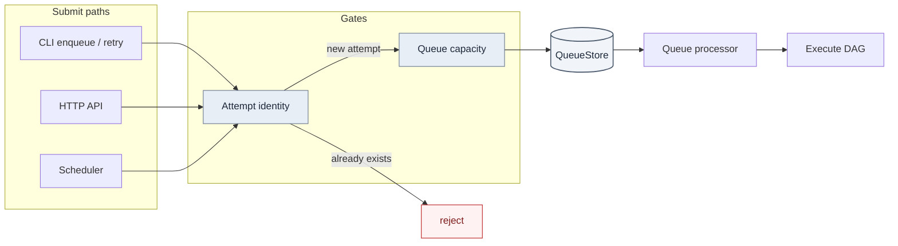
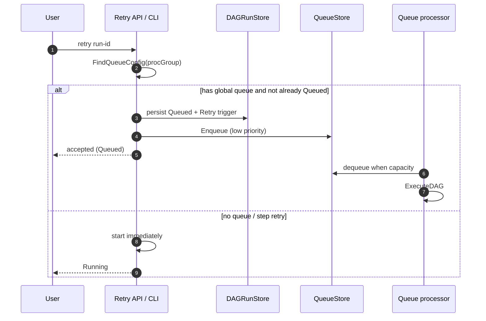

# How we built enqueue, retry, and dedup in a Go DAG scheduler

**Dagu** is an open-source, local-first workflow orchestrator (YAML DAGs, scheduler, queues, UI). I contribute Go backend + UI to [dagucloud/dagu](https://github.com/dagucloud/dagu) (formerly `dagu-org` / `yohamta`). This post covers three problems that show up once "run a DAG" becomes a **durable work queue**: enqueue routing, capacity-aware retries, and keeping runs reproducible / non-duplicated.

I'm a contributor, not the sole author. Queues in Dagu didn't start as an OSS feature request — they started as a production need while I worked on **INSAT-3DS data ingestion at ISRO**: realtime raw-data image processing when a pass lands, plus bulk reprocess of historical chunks. We built and stress-tested the queue inside the org, then pitched it to maintainer [@yota-hamada](https://github.com/yohamta). That path is [#690](https://github.com/dagucloud/dagu/pull/690) → [#938](https://github.com/dagucloud/dagu/issues/938) → co-authored landing in [#940](https://github.com/dagucloud/dagu/pull/940) / [`b98063d`](https://github.com/dagucloud/dagu/commit/b98063dd874acdea7745a985e714b1f3b9f97754). Links below are my follow-on merged PRs on routing, capacity-aware retry, and reproducibility. Adjacent features (singleton enqueue, cursor pagination, SSE) are later maintainer work and noted as such.

---

## The shape of the problem

A DAG scheduler has to answer:

1. **Where does this run go?** (which queue / priority)
2. **What happens when it fails?** (retry now vs later, under what policy)
3. **How do we avoid duplicate or drifted runs?** (same identity, locked params, capacity honesty)

Naive answers ("just start the process") break under load: retries bypass capacity, queue config stuck in YAML can't handle "replay on the low-priority queue," and any nonzero exit gets treated the same.



---


## Origin: INSAT-3DS ingest at ISRO, then upstream

While working on **INSAT-3DS data ingestion at ISRO**, we ran Dagu on satellite raw-data image processing: realtime streams when a pass lands, and occasional **reprocess** jobs that dump a huge historical chunk back through the same DAGs. Capacity is the hard part — too many concurrent runs and the workers melt; too few and the downlink backlog grows.

**Before queues existed in Dagu**, we bolted on a sidecar microservice: watch how many DAGs are running, and only ingest/start new work when under a limit. That gated starts, but it was a blind spot for everything waiting. Operators couldn't tell **running vs queued vs stuck**, reprocess floods looked the same as realtime, and the control loop lived outside the orchestrator — another service to deploy, another source of truth to distrust under load.

So we **implemented a real queue inside Dagu in our org**, stress-tested it on production traffic (realtime + bulk reprocess), and only then pitched the design to maintainer [@yota-hamada](https://github.com/yohamta).

That production prototype is [#690](https://github.com/dagucloud/dagu/pull/690): file-backed queue + running-count stats, a path so dequeued work went straight to running, and `DAGQueueLength`. It ran with multiple concurrent DAGs in prod; upstream closed the PR as too large to review in one shot — fair for reviewability, painful when you've already proven it under satellite load.

The work didn't die. Issue [#938](https://github.com/dagucloud/dagu/issues/938) cites `#690` as the initial implementation and absorbed ideas we needed in ops: **config toggle to enable/disable queuing**, and **dequeue** so you can cancel work still waiting (critical when a bad reprocess batch is filling the pipe).

Queues landed in main as [#940](https://github.com/dagucloud/dagu/pull/940) ([`b98063d`](https://github.com/dagucloud/dagu/commit/b98063dd874acdea7745a985e714b1f3b9f97754)). The commit records the lineage in the open:

> Original implementation by Kriyanshi: …/pull/690  
> Co-authored-by: Kriyanshi Shah

What that change introduced (the foundation everything below builds on):

- **`Queued` status** (API + scheduler) — waiting work is first-class, not a fake "not started"
- **CLI `enqueue` / `dequeue`** — create a run as Queued, persist it, push/pop via `QueueStore`
- **File-backed `DualQueue`** — high/low priority item files under a per-DAG queue dir (local-first, no Redis)
- **Scheduler queue reader + processor** — drain when concurrency allows, with a `ProcStore` for live process tracking
- **Paths + UI** — `queueDir` / `procDir`, Queued chips, workflow actions wired to the new status

Lineage in one line: **INSAT-3DS ingest pain at ISRO → in-org implementation + prod stress test → pitch to Yota → co-authored upstream**. The rest of this post is what I built on top once queues lived in main: routing overrides (realtime vs reprocess queues), retries that honor capacity, and locks so bulk reprocess runs stay reproducible.

## 1. Enqueue is a first-class path (not a side door)

**Queue override.** DAG YAML can declare a default queue, but operators often need this run on a different queue (backfill vs realtime) without editing the file.

Design:

- Persist an optional `Queue` on run status at enqueue time
- Resolution order: **stored override → DAG YAML `queue` → DAG name**

```bash
dagu enqueue --queue="realtime" data_processor.yaml
```

PR: [#1240 Add Queue Override Support for DAG Enqueue Operations](https://github.com/dagucloud/dagu/pull/1240)

**Enqueue from a spec.** API to enqueue a DAG-run from inline YAML (not only a file on disk) — useful for automation that composes runs dynamically.

PR: [#1375 New API endpoint for enqueuing a DAGRun from a spec](https://github.com/dagucloud/dagu/pull/1375)

**Operator hygiene.** Clear a queue; dequeue must pass the queue name (`ProcGroup`) or items get lost.

PRs: [#1299 clear queue](https://github.com/dagucloud/dagu/pull/1299), [#1481 include queue name in dequeue](https://github.com/dagucloud/dagu/pull/1481)

---

## 2. Retry must respect the same capacity as enqueue

The bug class: **retry ran immediately and skipped global queue capacity.**

Symptom: capacity = 3, but after retries you'd see 4 running. UI and scheduler disagreed. "Retry = start again" was wrong once queues existed.

Fix for DAGs on a global queue:

- Mark attempt **Queued**, stamp queue metadata, trigger type = Retry
- Enqueue at **low priority**
- Let the queue processor start it when capacity exists
- Step-level retry still runs immediately (processor doesn't carry step context)



PR: [#1676 scheduler: respect global queue capacity on retry](https://github.com/dagucloud/dagu/pull/1676)

**Exit-code-aware step retry.** Retries shouldn't fire on every failure. Step `retry_policy` can allowlist exit codes — retry on 429/503, fail fast otherwise.

```yaml
steps:
  - run: curl https://api.example.com/data
    retry_policy:
      limit: 6
      interval_sec: 1
      exit_code: [429, 503]
```

PR: [#902 custom exit codes on retry](https://github.com/dagucloud/dagu/pull/902)

Also: disable step-retry controls while the parent DAG is still running ([#1447](https://github.com/dagucloud/dagu/pull/1447)).

---

## 3. Dedup and reproducibility

**Parameter / run-ID locking.** For backfills, science pipelines, and audits, params and run identity shouldn't drift in the UI mid-flight:

```yaml
run_config:
  disable_param_edit: true
  disable_run_id_edit: true
```

PR: [#1176 Add DAG configuration to lock parameters and run ID](https://github.com/dagucloud/dagu/pull/1176)

**Attempt identity on enqueue.** Enqueue checks for an existing attempt before creating one — same DAG + run ID already exists ⇒ refuse. That store-backed identity is the foundation; opt-in **singleton** (409 if already running/queued) later landed as maintainer work ([#1483](https://github.com/dagucloud/dagu/pull/1483)) on top of the same problem space. Lesson: check-then-act alone is TOCTOU; real uniqueness needs store semantics.

---

## Status UX (supporting cast)

- Configurable "latest status" window ([#558](https://github.com/dagucloud/dagu/pull/558))
- Fix DAG list truncation from a hardcoded paginator cap ([#1126](https://github.com/dagucloud/dagu/pull/1126))
- Running/failed step names on run summaries for faster triage ([#1420](https://github.com/dagucloud/dagu/pull/1420))

Cursor pagination and SSE live updates were maintainer follow-ons — they scale the UI without changing the queue/retry core.

---

## Tradeoffs I'd make again

| Choice | Why | Cost |
|---|---|---|
| Retries go through the queue | Capacity stays honest; UI matches reality | Slightly higher latency to restart |
| Persist queue override on status | Routing survives restarts / processor hops | Extra field + resolution rules |
| Lock params / run ID | Reproducibility for batch & science | Less "edit and hot-retry" flexibility |
| Exit-code allowlist on retry | Fewer useless retries | Authors must document exit contracts |
| File-backed queues | Simple local-first ops | Harder atomic singleton than Redis |

---

## Why this matters for platform / workflow hiring

Same problem space as Temporal task queues, K8s job controllers, and CI runners — and the same shape we hit on INSAT-3DS ingest at ISRO: **admit work, bound concurrency, see running vs queued clearly, retries that don't stampede, reproducible dispatch for bulk reprocess.**

- GitHub: [github.com/kriyanshii](https://github.com/kriyanshii)
- Portfolio: [kriyanshii.github.io](https://kriyanshii.github.io/)
- Dagu: [github.com/dagucloud/dagu](https://github.com/dagucloud/dagu)
- Related: [Partial Success in DAG Systems (Medium)](https://medium.com/@kriyanshii/understanding-partial-success-in-dag-systems-building-resilient-workflows-977de786100f)

### My PRs referenced
- [#690](https://github.com/dagucloud/dagu/pull/690) original queue implementation (closed; design basis)
- [#938](https://github.com/dagucloud/dagu/issues/938) queue feature issue citing #690
- [#940](https://github.com/dagucloud/dagu/pull/940) / [`b98063d`](https://github.com/dagucloud/dagu/commit/b98063dd874acdea7745a985e714b1f3b9f97754) queues land in main (co-authored; credits #690)
- [#902](https://github.com/dagucloud/dagu/pull/902) exit-code retry  
- [#1176](https://github.com/dagucloud/dagu/pull/1176) lock parameters + run ID  
- [#1240](https://github.com/dagucloud/dagu/pull/1240) queue override on enqueue  
- [#1375](https://github.com/dagucloud/dagu/pull/1375) enqueue from spec API  
- [#1676](https://github.com/dagucloud/dagu/pull/1676) capacity-aware retry  
- [#1299](https://github.com/dagucloud/dagu/pull/1299) / [#1481](https://github.com/dagucloud/dagu/pull/1481) queue ops  
- [#1420](https://github.com/dagucloud/dagu/pull/1420) / [#1447](https://github.com/dagucloud/dagu/pull/1447) status UX  
- [#1613](https://github.com/dagucloud/dagu/pull/1613) production Helm chart (K8s signal)
